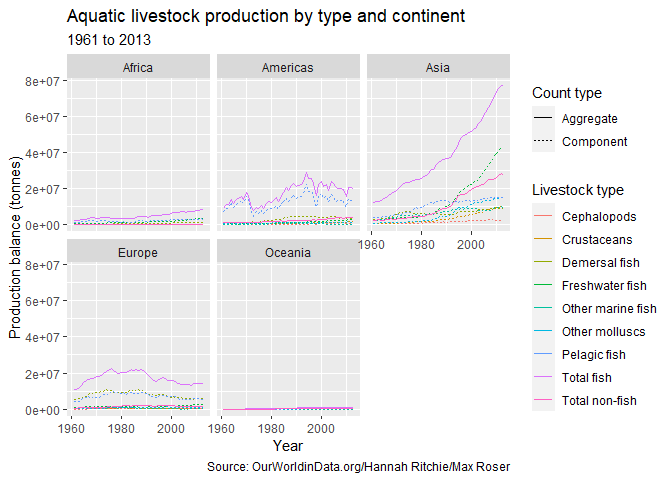
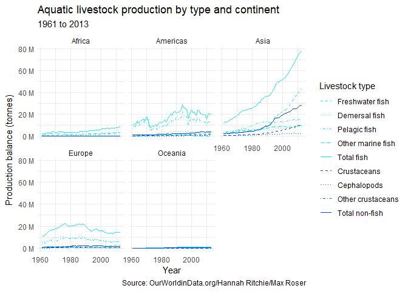

Code-along, Week 04: Fisheries
================
Alex Homer
14 October 2021

``` r
library(tidyverse)
library(scales)
#This document also requires the `emo` package, for emoji.  To install it if
#necessary, make sure `devtools` is installed, then run
# devtools::install_github("hadley/emo")
#For projects created from 16th October 2021, this should be already installed
#if you're working in the course space on RStudio Cloud
```

## Read data

The data are drawn from the “Tidy Tuesday” project: [2021 Week 42:
Global
Fishing](https://github.com/rfordatascience/tidytuesday/blob/master/data/2021/2021-10-12/readme.md)
(credit:
[OurWorldinData.org](https://ourworldindata.org/seafood-production),
from Hannah Ritchie and Max Roser).

``` r
farmed <- read_csv(
  "https://raw.githubusercontent.com/rfordatascience/tidytuesday/master/data/2021/2021-10-12/aquaculture-farmed-fish-production.csv"
)
captured_vs_farmed <- read_csv(
  "https://raw.githubusercontent.com/rfordatascience/tidytuesday/master/data/2021/2021-10-12/capture-fisheries-vs-aquaculture.csv"
)
captured <- read_csv(
  "https://raw.githubusercontent.com/rfordatascience/tidytuesday/master/data/2021/2021-10-12/capture-fishery-production.csv"
)
consumption <- read_csv(
  "https://raw.githubusercontent.com/rfordatascience/tidytuesday/master/data/2021/2021-10-12/fish-and-seafood-consumption-per-capita.csv"
)
stock <- read_csv(
  "https://raw.githubusercontent.com/rfordatascience/tidytuesday/master/data/2021/2021-10-12/fish-stocks-within-sustainable-levels.csv"
)
fishery <- read_csv(
  "https://raw.githubusercontent.com/rfordatascience/tidytuesday/master/data/2021/2021-10-12/global-fishery-catch-by-sector.csv"
)
production <- read_csv(
  "https://raw.githubusercontent.com/rfordatascience/tidytuesday/master/data/2021/2021-10-12/seafood-and-fish-production-thousand-tonnes.csv"
)
```

We have a lot of data frames this week!

## Data cleanup

Let’s start with the `production` dataset. The column names are very
informative, but they’re also very long and so hard to work with—in
particular, they contain spaces, which means that, to work with them, we
need to enclose their names in backticks (\`\`\`s). Really, we probably
want the information they contain in a data dictionary, though we may
want to add it back in when we’re making plot legends, etc.

We first fix the column names and pivot the data to long form [1].

``` r
production_cleaned <- production %>%
  rename(
    entity = Entity,
    code = Code,
    yr = Year, #Avoid conflict with the `year` function
    balance_pelagic_fish = `Commodity Balances - Livestock and Fish Primary Equivalent - Pelagic Fish - 2763 - Production - 5510 - tonnes`,
    balance_crustaceans = `Commodity Balances - Livestock and Fish Primary Equivalent - Crustaceans - 2765 - Production - 5510 - tonnes`,
    balance_cephalopods = `Commodity Balances - Livestock and Fish Primary Equivalent - Cephalopods - 2766 - Production - 5510 - tonnes`,
    balance_demersal_fish = `Commodity Balances - Livestock and Fish Primary Equivalent - Demersal Fish - 2762 - Production - 5510 - tonnes`,
    balance_freshwater_fish = `Commodity Balances - Livestock and Fish Primary Equivalent - Freshwater Fish - 2761 - Production - 5510 - tonnes`,
    balance_other_molluscs = `Commodity Balances - Livestock and Fish Primary Equivalent - Molluscs, Other - 2767 - Production - 5510 - tonnes`,
    balance_other_marine_fish = `Commodity Balances - Livestock and Fish Primary Equivalent - Marine Fish, Other - 2764 - Production - 5510 - tonnes`
  )

production_longer <- production_cleaned %>%
  pivot_longer(
    starts_with("balance"),
    names_to = "marine_type",
    values_to = "balance",
    names_prefix = "balance_"
  ) %>%
  mutate(
    marine_type = marine_type %>%
      str_to_sentence() %>%
      str_replace_all(pattern = "_", replacement = " ")
  )
```

## Making a plot

Now, let’s get totals for fish and not fish.

``` r
fish_or_not_totals <- production_longer %>%
  mutate(
    is_fish = if_else(
      marine_type %in% c("Crustaceans", "Cephalopods", "Other molluscs"),
      true = "Total non-fish",
      false = "Total fish"
    )
  ) %>%
  group_by(entity, code, yr, is_fish) %>%
  summarise(balance = sum(balance)) %>%
  rename(marine_type = is_fish)
```

If we use regular expressions, we can make this a little bit neater, so
we can detect anything that ends with “fish”.

``` r
fish_or_not_totals <- production_longer %>%
  mutate(
    is_fish = if_else(
      str_detect(marine_type, "fish$"),
      true = "Total fish",
      false = "Total non-fish"
    )
  ) %>%
  group_by(entity, code, yr, is_fish) %>%
  summarise(balance = sum(balance)) %>%
  rename(marine_type = is_fish)
```

It might seem a bit strange that we’re ending by renaming `is_fish` back
to `marine_type`, which overwrites the existing `marine_type` column.
The purpose of this is to allow our totals to be neatly bound to our
original dataset, so that we can easily display everything in one
`ggplot`.

(It’s also inefficiently written here, because we could therefore just
start by overwriting `marine_type` straight away in the `mutate`
statement. The reason we don’t is that in the live code-along we first
created it as a new column, and then renamed it later.)

We’d like to put these together, and also keep track of whether rows are
totals or not.

``` r
fish_or_not_totals_prep <- fish_or_not_totals %>%
  mutate(is_total = "Aggregate")

production_with_totals <- production_longer %>%
  mutate(is_total = "Component") %>%
  bind_rows(fish_or_not_totals_prep) %>%
  arrange(entity, code, yr)
```

Now let’s make a graph!

``` r
continents <- c("Africa", "Americas", "Asia", "Europe", "Oceania")
#This is something were we have to look back at the original data, because
#continents can be encoded in different ways

production_with_totals %>%
  filter(entity %in% continents) %>%
  ggplot(aes(x = yr, y = balance, colour = marine_type, linetype = is_total)) +
  geom_line() +
  facet_wrap(~entity) +
  labs(
    x = "Year",
    y = "Production balance (tonnes)",
    colour = "Livestock type",
    linetype = "Count type",
    title = "Aquatic livestock production by type and continent",
    subtitle = paste(
      min(
        production_with_totals %>%
          filter(entity %in% continents) %>%
          select(yr)
      ),
      "to",
      max(
        production_with_totals %>%
          filter(entity %in% continents) %>%
          select(yr)
      )
      #A rare occasion in ggplot where it doesn't remember what dataset we're
      #using; this is annoying
      
      #If we're doing this, it might be neater to first filter and store our
      #dataset as `production_continents`, and then use
      #`min(production_continents$yr)` and `max(production_continents$yr)`
    ),
    caption = "Source: OurWorldinData.org/Hannah Ritchie/Max Roser"
  )
```

<!-- -->

*(As an aside, here’s an advanced R way of doing this that I had to look
up on [Stack
Overflow](https://stackoverflow.com/questions/45088454/how-do-i-access-the-data-frame-that-has-been-passed-to-ggplot)!
It’s neater but less readable, and uses the `.` “pronoun” in R to allow
the data to be piped into two different places. Don’t worry if you’re
not sure what’s going on here, but feel free to ask me about it if you
like.)*

``` r
production_with_totals %>%
  filter(entity %in% continents) %>% {
    ggplot(
      .,
      aes(
        x = yr,
        y = balance,
        colour = marine_type,
        linetype = is_total
      )
    ) +
    geom_line() +
    facet_wrap(~entity) +
    labs(
      x = "Year",
      y = "Production balance (tonnes)",
      colour = "Livestock type",
      linetype = "Count type",
      title = "Aquatic livestock production by type and continent",
      subtitle = paste(min(.$yr), "to", max(.$yr)),
      caption = "Source: OurWorldinData.org/Hannah Ritchie/Max Roser"
    )
  }
```

<!-- -->

Okay, so this is great and all, but I’m not sure it’s what I wanted.
It’s a bit excessive that we have a separate legend for “Count type”,
when that’s implicit in the “Livestock type” legend; I just wanted the
totals to be shown with a different line type. You can get such
redundant labels when one of your categorical variables is just there to
group together other variables.

Actually, what would be really cool would be to have the fish and the
non-fish shown in two different colours, and the different types of fish
making up each indicated by line types. Unfortunately, `ggplot2` isn’t
able to deal with such detailed requirements via any automatic functions
[2], so we’re just going to have to specify our colours and line types
manually.

At the same time, we’ll make the scale on the *y*-axis look a bit nicer.

``` r
production_continents <- production_with_totals %>%
  filter(entity %in% continents) 

fishcol <- "#23F0EA"
noncol <- "#004AFA"
#Colourblind-friendly colours picked using #https://color.adobe.com/create/color-accessibility
#Stored here so there's only one place to amend them if we want to pick
#different colours

production_continents %>%
  mutate(
    marine_type = factor(
      marine_type,
      levels = c(
        "Freshwater fish",
        "Demersal fish", #A type of marine fish
        "Pelagic fish", #A type of marine fish
        "Other marine fish",
        "Total fish",
        "Crustaceans",
        "Cephalopods", #A type of mollusc
        "Other molluscs",
        "Total non-fish"
      ) #To force the levels into a particular order
    )
  ) %>%
  ggplot(
    aes(
      x = yr,
      y = balance,
      colour = marine_type,
      linetype = marine_type
      #We need to use the most "granular" category for both line aesthetics
    )
  ) +
  geom_line() +
  facet_wrap(~entity) +
  scale_y_continuous(labels = label_number(scale = 1e-6, suffix = " M")) +
  scale_colour_manual(
    values = c(
      "Freshwater fish" = fishcol,
      "Demersal fish" = fishcol,
      "Pelagic fish" = fishcol,
      "Other marine fish" = fishcol,
      "Total fish" = fishcol,
      "Crustaceans" = noncol,
      "Cephalopods" = noncol,
      "Other crustaceans" = noncol,
      "Total non-fish" = noncol
    )
  ) +
  scale_linetype_manual(
    values = c(
      "Freshwater fish" = "dashed",
      "Demersal fish" = "dotted",
      "Pelagic fish" = "dotdash",
      "Other marine fish" = "longdash",
      "Total fish" = "solid",
      "Crustaceans" = "dashed",
      "Cephalopods" = "dotted",
      "Other crustaceans" = "dotdash",
      "Total non-fish" = "solid"
    )
  ) +
  labs(
    x = "Year",
    y = "Production balance (tonnes)",
    colour = "Livestock type",
    linetype = "Livestock type", #Same label + same mapping combines legends
    title = "Aquatic livestock production by type and continent",
    subtitle = paste(
      min(production_continents$yr),
      "to",
      max(production_continents$yr)),
    caption = "Source: OurWorldinData.org/Hannah Ritchie/Max Roser"
  ) +
  theme_minimal() +
  #Nudge y label to the left by giving it a margin on the right
  theme(axis.title.y = element_text(margin = margin(r = 6))) 
```

<!-- -->

💡 *Is there a better way to display this? (The answer is almost
certainly “yes”—I won’t have found the optimal way—but which way is best
is an open question.)* 💡

## The other data frames

We didn’t even get onto the other data in the live code-along. One thing
that’s worth noting here is that many of them, such as `farmed` and
`captured`, have one entry per entity and year [3].

``` r
set.seed(14101583) #Makes sure the "random" number is the same each time we knit

nr <- nrow(captured)

k <- sample(nr-5, size = 1) #Random start row
slice(captured, k:(k+5))
```

    ## # A tibble: 6 x 4
    ##   Entity           Code   Year `Capture fisheries production (metric tons)`
    ##   <chr>            <chr> <dbl>                                        <dbl>
    ## 1 Papua New Guinea PNG    2001                                      156609.
    ## 2 Papua New Guinea PNG    2002                                      169730.
    ## 3 Papua New Guinea PNG    2003                                      203811.
    ## 4 Papua New Guinea PNG    2004                                      294400.
    ## 5 Papua New Guinea PNG    2005                                      285405.
    ## 6 Papua New Guinea PNG    2006                                      285827.

``` r
k <- sample(nr-5, size = 1) #Doing it again
slice(captured, k:(k+5))
```

    ## # A tibble: 6 x 4
    ##   Entity        Code   Year `Capture fisheries production (metric tons)`
    ##   <chr>         <chr> <dbl>                                        <dbl>
    ## 1 North America <NA>   1997                                      6660583
    ## 2 North America <NA>   1998                                      6351406
    ## 3 North America <NA>   1999                                      6482686
    ## 4 North America <NA>   2000                                      6163458
    ## 5 North America <NA>   2001                                      6549189
    ## 6 North America <NA>   2002                                      6721161

``` r
#Checking that each entity--year combo only appears once:
captured %>% count(Entity, Year) %>%
  count(n, name = "frequency")
```

    ## # A tibble: 1 x 2
    ##       n frequency
    ##   <int>     <int>
    ## 1     1     14516

``` r
#Interpretation: there are 14,516 entity--year combinations in the data, and
#each appears only once.
```

💡 *Is it similar for the others?* 💡

So if we’re trying to join all such datasets into one full dataset, we
probably *don’t* want to be working straight away with the
`production_longer` dataset, but rather the original in wide format.
Although it’s perhaps a little frustrating, here the best option is to
say that each entity–year combination is what counts as one observation.

Let’s do that joining. Since we don’t want to lose any data, we’ll do a
`full_join`—but first we should do some cleanup. Since we’ll want to do
the same renaming several times, we’ll define a function for that (don’t
worry, you haven’t seen functions yet! You could also do this by just
repeating the same three arguments inside each of the `rename` functions
that follows).

``` r
clean_standard_names <- function(.data) {
  rename(.data, entity = Entity, code = Code, yr = Year)
}

captured_cleaned <- captured %>%
  clean_standard_names() %>%
  rename(capture_production = `Capture fisheries production (metric tons)`)

consumption_cleaned <- consumption %>%
  clean_standard_names() %>%
  rename(consumption = `Fish, Seafood- Food supply quantity (kg/capita/yr) (FAO, 2020)`)

farmed_cleaned <- farmed %>%
  clean_standard_names() %>%
  rename(farmed = `Aquaculture production (metric tons)`)
```

Now we can join them. (This is very close to the point where we might
define a function to avoid having to put the same long argument in three
times, but let’s not for now.)

``` r
fisheries_full <- captured_cleaned %>%
  full_join(consumption_cleaned, by = c("entity", "code", "yr")) %>%
  #We need to join by "code" as well because otherwise we'll get a load of
  #redundant code columns---even though it doesn't give us any additional
  #information, we have to specify all columns that are common between the two
  #datasets, unless we have a good reason for keeping them separate
  full_join(farmed_cleaned, by = c("entity", "code", "yr")) %>%
  full_join(production_cleaned, by = c("entity", "code", "yr")) %>%
  arrange(entity, code, yr)
  #To get the data back into the same order as they should be

glimpse(fisheries_full)
```

    ## Rows: 16,683
    ## Columns: 13
    ## $ entity                    <chr> "Afghanistan", "Afghanistan", "Afghanistan",~
    ## $ code                      <chr> "AFG", "AFG", "AFG", "AFG", "AFG", "AFG", "A~
    ## $ yr                        <dbl> 1960, 1961, 1962, 1963, 1964, 1965, 1966, 19~
    ## $ capture_production        <dbl> 200, 300, 300, 300, 300, 300, 300, 400, 400,~
    ## $ consumption               <dbl> NA, 0.03, 0.03, 0.03, 0.03, 0.03, 0.03, 0.04~
    ## $ farmed                    <dbl> NA, NA, NA, NA, NA, NA, NA, NA, NA, 60, 60, ~
    ## $ balance_pelagic_fish      <dbl> NA, NA, NA, NA, NA, NA, NA, NA, NA, NA, NA, ~
    ## $ balance_crustaceans       <dbl> NA, NA, NA, NA, NA, NA, NA, NA, NA, NA, NA, ~
    ## $ balance_cephalopods       <dbl> NA, NA, NA, NA, NA, NA, NA, NA, NA, NA, NA, ~
    ## $ balance_demersal_fish     <dbl> NA, NA, NA, NA, NA, NA, NA, NA, NA, NA, NA, ~
    ## $ balance_freshwater_fish   <dbl> NA, 300, 300, 300, 300, 300, 300, 400, 400, ~
    ## $ balance_other_molluscs    <dbl> NA, NA, NA, NA, NA, NA, NA, NA, NA, NA, NA, ~
    ## $ balance_other_marine_fish <dbl> NA, NA, NA, NA, NA, NA, NA, NA, NA, NA, NA, ~

The `fishery` and `stock` data frames have a less-similar structure, so
we won’t try and join them, but we should clean them up a bit.

``` r
fishery_cleaned <- fishery %>%
  clean_standard_names() %>%
  rename(
    artisanal = `Artisanal (small-scale commercial)`,
    discards = Discards,
    industrial = `Industrial (large-scale commercial)`,
    recreational = Recreational,
    subsistence = Subsistence
  )

stock_cleaned <- stock %>%
  clean_standard_names() %>%
  rename(
    sustainable_share = `Share of fish stocks within biologically sustainable levels (FAO, 2020)`,
    overexploited_share = `Share of fish stocks that are overexploited`
  )
```

💡 *We haven’t actually done anything with these other data frames. Can
you think of any interesting analyses we could perform or visualisations
we could make?* 💡

[1] Note the choice of name for what we might consider to be a country
column, `entity`. This reflects the fact that some of the entries in
that column are unambiguously not countries—like the second distinct
entry, “Africa”—but also neatly sidesteps the fact that “country” can be
a politically charged term, since people disagree on which political
entities which exist in practice should be regarded as countries in
their own right.

[2] Maybe in `ggplot7`…

[3] And code, I suppose, but each entity corresponds to only one code.
